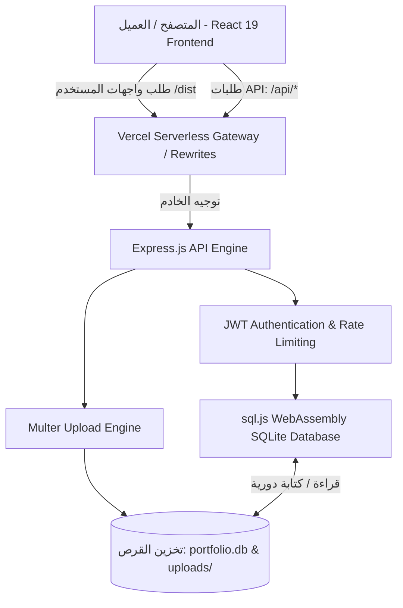
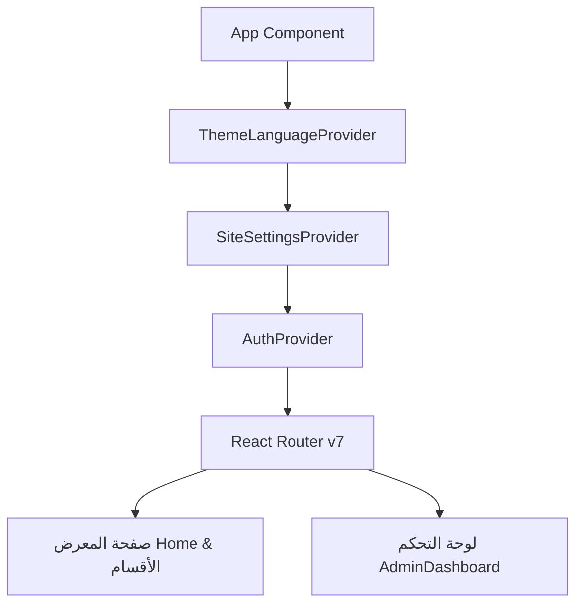

# 📘 التوثيق الشامل لمشروع معرض الأعمال ولوحة التحكم الإدارية (Hamza Eshtiba Portfolio & CMS)

---

## 📑 فهرس المحتويات
1. [نظرة عامة على المشروع (Project Overview)](#1-نظرة-عامة-على-المشروع-project-overview)
2. [الميزات والوظائف الأساسية (Key Features)](#2-الميزات-والوظائف-الأساسية-key-features)
3. [الهيكل المعماري للنظام (Architecture & Tech Stack)](#3-الهيكل-المعماري-للنظام-architecture--tech-stack)
4. [هيكلية المجلدات والملفات بالتفصيل (Detailed Directory Structure)](#4-هيكلية-المجلدات-والملفات-بالتفصيل-detailed-directory-structure)
5. [مخطط وتصميم قاعدة البيانات (Database Schema)](#5-مخطط-وتصميم-قاعدة-البيانات-database-schema)
6. [دليل الواجهات البرمجية (API Documentation)](#6-دليل-الواجهات-البرمجية-api-documentation)
7. [إدارة الحالة وأنظمة الواجهة (Frontend Systems & State Management)](#7-إدارة-الحالة-وأنظمة-الواجهة-frontend-systems--state-management)
8. [الأمان والحماية (Security Implementation)](#8-الأمان-والحماية-security-implementation)
9. [دليل التشغيل والإعداد المحلي (Local Setup & Installation)](#9-دليل-التشغيل-والإعداد-المحلي-local-setup--installation)
10. [دليل النشر والاستضافة السحابية (Deployment Guide)](#10-دليل-النشر-والاستضافة-السحابية-deployment-guide)

---

## 1. نظرة عامة على المشروع (Project Overview)

مشروع **Hamza Eshtiba Portfolio & CMS** هو منصة ويب متكاملة (Full-Stack) متطورة وعصرية، تجمع بين:
1. **معرض أعمال شخصي تفاعلي (Interactive Portfolio):** يعرض هوية المهندس حمزة اشطيبه، مهاراته التقنية، خبراته العملية، مشاريعه المنجزة، خدماته، وطرق التواصل المباشر معه، مع إمكانية استعراض وتحميل السيرة الذاتية (CV) بصيغة PDF فورياً.
2. **نظام إدارة محتوى إداري مخصص (Headless / Embedded CMS Dashboard):** لوحة تحكم متكاملة ومحمية تسمح للمسؤول بإدارة جميع عناصر الموقع ديناميكياً (نصوص، إحصائيات، أقسام، مشاريع، وسائط، ورسائل تواصل) دون الحاجة للمساس بالكود المصدري.
3. **دعم ثنائي للغات والمظاهر (Bilingual & Dark/Light Themes):** دعم كامل للغتين العربية والإنجليزية مع اتجاه الكتابة التلقائي (`RTL` و `LTR`)، والتبديل السلس بين المظهر الليلي والنهاري.

---

## 2. الميزات والوظائف الأساسية (Key Features)

### 🌟 واجهة المستخدم العامة (Public Portfolio)
- **قسم البداية (Hero Section):** شريط إعلاني نابض (Status Badge)، شعار احترافي، أزرار دعوة لاتخاذ إجراء (CTAs)، إحصائيات منجزة ديناميكية، وبطاقة HUD عائمة تعرض الخدمات المتخصصة.
- **قسم نبذة عني (About Section):** سيرة مهنية تفصيلية، بطاقات أبرز التقنيات، ونظام المعاينة السريعة للسيرة الذاتية (CV Modal & Downloader).
- **قسم المهارات التقنية (Skills Section):** تصنيف المهارات حسب الفئات (Frontend, Backend, Database, DevOps)، أشرطة تقدم تفاعلية (Progress Bars)، وعلامات الوسوم (Skill Tags).
- **معرض المشاريع (Projects Section):** نظام فلترة للمشاريع، بطاقات تعرض تفاصيل المشروع وصوره المتعددة وروابط المعاينة الحية وكود GitHub، مع نافذة منبثقة موسعة لتفاصيل المشروع (Project Details Modal).
- **الخدمات البرمجية (Services Section):** بطاقات تفاعلية تسلط الضوء على الحلول والخدمات البرمجية المتوفرة.
- **المسيرة المهنية والخبرات (Experience Section):** خط زمني (Timeline) تفاعلي يعرض الشركات، المسميات الوظيفية، الفترات الزمنية، والتقنيات المستخدمة.
- **نموذج التواصل (Contact Form):** نموذج مراسلة مباشر مع تحقق كامل من صحة البيانات (Validation) وحفظ الرسائل في قاعدة البيانات مع إرسال إشعارات فورية عبر الواجهة.
- **توليد السيرة الذاتية (Interactive CV):** معاينة منبثقة للسيرة الذاتية بتصميم أنيق وقابلة للتصدير والتحميل المباشر كملف PDF عالي الدقة بضغطة زر واحدة.

### 🛡️ لوحة التحكم الإدارية (Admin Dashboard & CMS)
- **نظام التوثيق وتسجيل الدخول (Auth System):** مصادقة آمنة باستخدام JWT Tokens، تشفير كلمات المرور بـ Bcrypt، وجلسات محمية مع إعادة توجيه ذكية للمسارات غير المصرح لها.
- **لوحة المؤشرات العامة (Dashboard Overview):** ملخص سريع لعدد المشاريع، الرسائل الواردة، ونقاط الوصول السريعة للعمليات.
- **إدارة المشاريع (Projects Management):**
  - إنشاء، تعديل، حذف، وإعادة ترتيب المشاريع.
  - دعم رفع حتى 5 صور لكل مشروع مع معاينة وحذف فوري.
  - تعيين المشاريع المميزة (Featured Projects Toggle).
- **نظام إدارة المحتوى المباشر (Visual CMS Customizer):**
  - تعديل نصوص الأقسام كاملة (العربية والإنجليزية).
  - تعديل بطاقات الخدمات وقوائم المهارات والخبرات.
  - التحكم في إظهار أو إخفاء أي قسم من الصفحة الرئيسية (Section Visibility Toggles).
- **صندوق الوارد والرسائل (Messages Inbox):**
  - استعراض رسائل الزوار مع التفاصيل الكاملة (الاسم، البريد، الموضوع، التاريخ).
  - تمييز الرسائل كمقروءة وحذف الرسائل غير المرغوبة.
- **إعدادات الحساب والنظام (Account Settings):** إمكانية تغيير كلمة مرور المدير وإدارة الجلسة الحالية.

---

## 3. الهيكل المعماري للنظام (Architecture & Tech Stack)

### 🏗️ المخطط المعماري العام (Architecture Flowchart)



### 💻 التقنيات المستخدمة (Tech Stack)

#### 1. الواجهة الأمامية (Frontend)
- **الإطار والمحرك الأساسي:** [React 19](https://react.dev/) + [Vite 8](https://vitejs.dev/)
- **التوجيه (Routing):** [React Router v7](https://reactrouter.com/)
- **إدارة البيانات والطلبات:** [Axios](https://axios-http.com/) + [@tanstack/react-query](https://tanstack.com/query/latest)
- **الحركات والتأثيرات التفاعلية:** [Framer Motion](https://www.framer.com/motion/) + [react-type-animation](https://github.com/maxmarinich/react-type-animation)
- **الأيقونات والتنبيهات:** [Lucide React](https://lucide.dev/) + [react-hot-toast](https://react-hot-toast.com/)
- **تصدير الـ PDF:** [html2pdf.js](https://ekoopmans.github.io/html2pdf.js/)
- **التصميم والتنسيقات (Styling):** Vanilla CSS مدعوم بنظام Design Tokens مرن، مصفوفات تدرجات لونية، تأثيرات الزجاج المصقول (Glassmorphism)، ومتغيرات ألوان متجاوبة للمظهرين الداكن والفاتح.

#### 2. الواجهة الخلفية (Backend)
- **البيئة والمحرك:** [Node.js](https://nodejs.org/) (ES Modules)
- **إطار العمل:** [Express.js](https://expressjs.com/)
- **قاعدة البيانات:** [sql.js](https://sql.js.org/) (SQLite3 عبر WebAssembly) تعمل في الذاكرة مع تصدير تلقائي للقرص لضمان العمل بسلاسة في بيئات الخوادم العادية والـ Serverless.
- **الأمان والتحقق:**
  - `jsonwebtoken` لإدارة الـ Access Tokens.
  - `bcryptjs` للتشفير من جانب الخادم (12 Salt Rounds).
  - `helmet` لضبط ترويسات الأمان (Security Headers).
  - `express-rate-limit` لمنع هجمات القوة الغاشمة ومعدل الطلبات العالي.
  - `express-validator` للتحقق وتطهير بيانات الإدخال.
- **إدارة الملفات والوسائط:** `multer` مع `uuid` لتوليد أسماء فريدة وفلترة أنواع الصور.

---

## 4. هيكلية المجلدات والملفات بالتفصيل (Detailed Directory Structure)

```text
portfolio-hamza/
│
├── api/                           # نقطة دخول Vercel Serverless Functions
│   └── index.js                   # تصدير تطبيق Express كـ Serverless Handler
│
├── backend/                       # خادم Express ومحرك الواجهة الخلفية
│   ├── data/                      # المجلد الافتراضي لقاعدة البيانات
│   │   └── portfolio.db           # ملف قاعدة بيانات SQLite المحفوظ
│   ├── src/                       # كود المصدر للـ Backend
│   │   ├── database/
│   │   │   └── init.js            # تهيئة قاعدة البيانات، الجداول، البيانات الافتراضية، ومساعدات الاستعلام
│   │   ├── middleware/
│   │   │   ├── auth.js            # وسيط التحقق من صحة JWT Token
│   │   │   ├── errorHandler.js    # المعالج المركزي للأخطاء
│   │   │   └── upload.js          # وسيط Multer للتحقق من الصور ورفعها
│   │   ├── routes/
│   │   │   ├── auth.js            # مسارات تسجيل الدخول، فحص المستخدم، وتغيير كلمة المرور
│   │   │   ├── contact.js         # مسارات استلام وقراءة وحذف رسائل التواصل
│   │   │   ├── projects.js        # مسارات إدارة المشاريع (CRUD & Featured)
│   │   │   ├── settings.js        # مسارات نظام إدارة المحتوى (Site Settings CMS)
│   │   │   └── uploads.js         # مسارات رفع وحذف الصور
│   │   ├── scripts/
│   │   │   ├── createAdmin.js     # أداة سطر أوامر تفاعلية لإنشاء حساب المدير أو تحديثه
│   │   │   └── seed.js            # بذر البيانات الأولية للمشاريع وحساب المدير الافتراضي
│   │   └── server.js              # ملف إعداد وبدء تشغيل خادم Express وميدلويرات الأمان
│   ├── uploads/                   # مجلد حفظ الصور المرفوعة محلياً
│   ├── .env.example               # نموذج المتغيرات البيئية للباك إند
│   ├── package.json               # حزم واعتمادات الباك إند
│   └── package-lock.json
│
├── frontend/                      # تطبيق الواجهة الأمامية مبني بـ React 19 + Vite
│   ├── public/                    # الملفات العامة الثابتة (الصور، الأيقونات)
│   │   └── hero.jpg               # الصورة الشخصية الافتراضية
│   ├── src/
│   │   ├── assets/                # الوسائط والملفات الثابتة المستخدمة بالكود
│   │   ├── components/
│   │   │   ├── admin/             # مكونات لوحة التحكم
│   │   │   │   ├── AdminCMS.jsx       # محرر المحتوى المرئي الشامل (CMS Editor)
│   │   │   │   ├── AdminMessages.jsx  # صندوق إدارة رسائل التواصل الواردة
│   │   │   │   ├── AdminOverview.jsx  # نظرة عامة وإحصائيات لوحة التحكم
│   │   │   │   ├── AdminProjects.jsx  # إدارة المشاريع (إضافة، تعديل، صور)
│   │   │   │   ├── AdminSettings.jsx  # إعدادات الأمان وتغيير كلمة المرور
│   │   │   │   └── AdminSidebar.jsx   # القائمة الجانبية للتنقل داخل لوحة التحكم
│   │   │   ├── auth/
│   │   │   │   └── ProtectedRoute.jsx # حماية مسارات لوحة التحكم وتوجيه غير المصرح لهم
│   │   │   ├── cv/
│   │   │   │   ├── CVDocument.jsx     # مستند السيرة الذاتية المهني القابل للطباعة والتحميل
│   │   │   │   └── CVModal.jsx        # النافذة المنبثقة لمعاينة السيرة الذاتية
│   │   │   ├── layout/
│   │   │   │   ├── Footer.jsx         # تذييل الموقع والروابط الاجتماعية
│   │   │   │   ├── Layout.jsx         # الهيكل العام للصفحة
│   │   │   │   ├── Navbar.jsx         # شريط التنقل العلوي مع مبدل اللغات والمظهر
│   │   │   │   └── ScrollReveal.jsx   # مكون لتأثيرات الظهور عند التمرير
│   │   │   └── sections/          # أقسام معرض الأعمال الرئيسية
│   │   │       ├── AboutSection.jsx      # قسم نبذة عني
│   │   │       ├── ContactSection.jsx    # قسم نموذج التواصل
│   │   │       ├── ExperienceSection.jsx # قسم الخبرات العملية والمسار المهني
│   │   │       ├── HeroSection.jsx       # قسم البداية والواجهة الترحيبية
│   │   │       ├── ProjectsSection.jsx   # قسم معرض المشاريع التفاعلي
│   │   │       ├── ServicesSection.jsx   # قسم الخدمات البرمجية
│   │   │       └── SkillsSection.jsx     # قسم المهارات والقدرات التقنية
│   │   ├── context/               # سياقات إدارة الحالة على مستوى التطبيق
│   │   │   ├── AuthContext.jsx           # إدارة جلسة المدير والـ Token
│   │   │   ├── SiteSettingsContext.jsx   # جلب وتوزيع إعدادات ونصوص الموقع من الـ CMS
│   │   │   └── ThemeLanguageContext.jsx  # إدارة مظهر الموقع (Dark/Light) واللغة (Ar/En)
│   │   ├── lib/
│   │   │   ├── api.js             # إعداد Axios و Interceptors وجميع دوال الاستدعاء
│   │   │   └── cvPdfGenerator.js  # دالة توليد وتنزيل الـ PDF باستخدام html2pdf.js
│   │   ├── pages/
│   │   │   ├── admin/
│   │   │   │   ├── AdminDashboard.jsx # الصفحة الرئيسية للوحة التحكم
│   │   │   │   └── AdminLogin.jsx     # صفحة تسجيل دخول المدير
│   │   │   └── Home.jsx           # الصفحة الرئيسية لمعرض الأعمال
│   │   ├── App.css                # تنسيقات مخصصة للأزرار والحركات
│   │   ├── App.jsx                # شجرة التوجيه وتوزيع السياقات
│   │   ├── index.css              # ملف التصميم الشامل (Design System & Theme Tokens)
│   │   └── main.jsx               # نقطة الدخول لتطبيق React
│   ├── index.html                 # ملف HTML الأساسي مع الوسوم الوصفية
│   ├── package.json               # حزم واعتمادات الفرونت إند
│   ├── vite.config.js             # إعدادات Vite ومنافذ التطوير
│   └── vercel.json                # إعدادات إعادة التوجيه لـ SPA على Vercel
│
├── data/                          # مجلد قاعدة البيانات الاحتياطية في الجذر
│   └── portfolio.db
├── package.json                   # ملف الحزم الرئيسي لإدارة مشروع Monorepo
├── render.yaml                    # إعدادات النشر على منصة Render
├── vercel.json                    # إعدادات النشر الموحد على منصة Vercel (Monorepo)
└── PROJECT_DOCUMENTATION.md       # هذا الملف (التوثيق الشامل)
```

---

## 5. مخطط وتصميم قاعدة البيانات (Database Schema)

تستخدم المنصة قاعدة بيانات **SQLite** سريعة وخفيفة الوزن تديرها مكتبة `sql.js`. تم تصميم الجداول بعناية لتغطية متطلبات المشروع:

### 1. جدول المدراء (`admins`)
يخزن بيانات المشرفين المسموح لهم بالدخول إلى لوحة التحكم الإدارية:
```sql
CREATE TABLE IF NOT EXISTS admins (
  id INTEGER PRIMARY KEY AUTOINCREMENT,
  email TEXT UNIQUE NOT NULL,
  password TEXT NOT NULL,
  created_at DATETIME DEFAULT CURRENT_TIMESTAMP,
  updated_at DATETIME DEFAULT CURRENT_TIMESTAMP
);
```

### 2. جدول المشاريع (`projects`)
يحتفظ بجميع المشاريع المعروضة وتفاصيلها:
```sql
CREATE TABLE IF NOT EXISTS projects (
  id TEXT PRIMARY KEY,                       -- UUID v4 فريد
  title TEXT NOT NULL,                      -- عنوان المشروع
  description TEXT NOT NULL,                -- وصف مختصر للمشروع
  long_description TEXT,                    -- وصف تفصيلي يعرض في نافذة التفاصيل
  technologies TEXT NOT NULL,               -- مصفوفة تقنيات بصيغة JSON String
  image_url TEXT,                           -- الصورة الرئيسية للمشروع
  github_url TEXT,                          -- رابط الكود المصدري على GitHub
  live_url TEXT,                            -- رابط المعاينة الحية للمشروع
  featured INTEGER DEFAULT 0,               -- 1 للمشاريع المميزة، 0 للعادية
  order_index INTEGER DEFAULT 0,            -- ترتيب العرض
  status TEXT DEFAULT 'published',          -- حالة المشروع ('published', 'draft')
  images TEXT DEFAULT '[]',                 -- مصفوفة صور المشروع (JSON String حتى 5 صور)
  created_at DATETIME DEFAULT CURRENT_TIMESTAMP,
  updated_at DATETIME DEFAULT CURRENT_TIMESTAMP
);
```

### 3. جدول رسائل التواصل (`contacts`)
يخزن الرسائل المستلمة من زوار الموقع عبر نموذج الاتصال:
```sql
CREATE TABLE IF NOT EXISTS contacts (
  id INTEGER PRIMARY KEY AUTOINCREMENT,
  name TEXT NOT NULL,                       -- اسم المرسل
  email TEXT NOT NULL,                      -- بريده الإلكتروني
  subject TEXT,                             -- موضوع الرسالة
  message TEXT NOT NULL,                    -- نص الرسالة
  read INTEGER DEFAULT 0,                   -- 0 = غير مقروءة، 1 = مقروءة
  created_at DATETIME DEFAULT CURRENT_TIMESTAMP
);
```

### 4. جدول إعدادات الموقع ونظام الـ CMS (`site_settings`)
جدول مفتاح-قيمة (Key-Value Store) مرن يسمح بتخزين كافة إعدادات ونصوص الموقع:
```sql
CREATE TABLE IF NOT EXISTS site_settings (
  key TEXT PRIMARY KEY,                     -- مفتاح الإعداد (مثل hero_settings, skills_settings)
  value TEXT NOT NULL,                      -- القيمة مخزنة كـ نص عادي أو كائن JSON
  updated_at DATETIME DEFAULT CURRENT_TIMESTAMP
);
```

#### المفاتيح الافتراضية المخزنة في `site_settings`:
- `sections_visibility`: كائن يحدد حالة إظهار/إخفاء أقسام الموقع (`hero`, `about`, `skills`, `projects`, `services`, `experience`, `contact`).
- `hero_settings`: نصوص البداية بالعربية والإنجليزية، أسماء الأزرار، الإحصائيات (سنوات الخبرة، المشاريع)، ونصوص بطاقة HUD.
- `about_settings`: السيرة الذاتية، الفقرات التعريفية والوسوم.
- `skills_settings`: الفئات الأربعة والمهارات مع نسبة كل مهارة (`level`) والوسوم العامة.
- `services_settings`: مصفوفة الخدمات مع الأيقونات والوصف باللغتين.
- `experience_settings`: مصفوفة الخبرات الوظيفية، الشركات، التواريخ، والتقنيات.
- `contact_email`, `github_url`, `linkedin_url`, `location`: روابط ومعلومات التواصل العامة.

---

## 6. دليل الواجهات البرمجية (API Documentation)

جميع المسارات تبدأ بـ `/api`. تعتمد الاستجابات على صيغة JSON الموحدة مع رموز حالات HTTP القياسية.

### 🔐 1. مسارات المصادقة (Authentication) - `/api/auth`
| الطريقة | المسار | الصلاحية | الوصف |
| :--- | :--- | :--- | :--- |
| `POST` | `/api/auth/login` | عام | تسجيل دخول المدير وإرجاع الـ JWT Token وبيانات الحساب |
| `GET` | `/api/auth/me` | محمي (Bearer Token) | التحقق من صحة جلسة المدير الحالية |
| `POST` | `/api/auth/change-password` | محمي (Bearer Token) | تغيير كلمة المرور الحالية بكلمة مرور جديدة |

### 🚀 2. مسارات المشاريع (Projects) - `/api/projects`
| الطريقة | المسار | الصلاحية | الوصف |
| :--- | :--- | :--- | :--- |
| `GET` | `/api/projects` | عام | استرجاع جميع المشاريع المنشورة (مع دعم الفلترة `featured=true` والـ `limit`) |
| `GET` | `/api/projects/admin` | محمي | استرجاع كافة المشاريع لمدير النظام (بما فيها المسودات) |
| `GET` | `/api/projects/:id` | عام | استرجاع تفاصيل مشروع محدد |
| `POST` | `/api/projects` | محمي | إنشاء مشروع جديد |
| `PUT` | `/api/projects/:id` | محمي | تحديث بيانات مشروع موجود |
| `DELETE` | `/api/projects/:id` | محمي | حذف مشروع نهائياً |
| `PATCH` | `/api/projects/:id/toggle-featured` | محمي | تبديل حالة تمييز المشروع (Featured / Unfeatured) |

### 📁 3. مسارات رفع وحذف الوسائط (Uploads) - `/api/uploads`
| الطريقة | المسار | الصلاحية | الوصف |
| :--- | :--- | :--- | :--- |
| `POST` | `/api/uploads/project-image` | محمي | رفع صورة مفردة لمشروع (Multer Single) |
| `POST` | `/api/uploads/project-images` | محمي | رفع صور متعددة (حتى 5 صور دفعة واحدة) |
| `DELETE` | `/api/uploads/:filename` | محمي | حذف صورة مخزنة من السيرفر |

### ✉️ 4. مسارات التواصل والرسائل (Contact) - `/api/contact`
| الطريقة | المسار | الصلاحية | الوصف |
| :--- | :--- | :--- | :--- |
| `POST` | `/api/contact` | عام (محدد بالمعدل) | إرسال رسالة تواصل جديدة من الزائر |
| `GET` | `/api/contact` | محمي | استعراض كافة رسائل التواصل في صندوق الوارد |
| `PATCH` | `/api/contact/:id/read` | محمي | تحديد الرسالة كـ "مقروءة" |
| `DELETE` | `/api/contact/:id` | محمي | حذف الرسالة نهائياً من قاعدة البيانات |

### ⚙️ 5. مسارات إعدادات الموقع ونظام الـ CMS - `/api/settings`
| الطريقة | المسار | الصلاحية | الوصف |
| :--- | :--- | :--- | :--- |
| `GET` | `/api/settings` | عام | جلب كافة إعدادات ونصوص وأقسام الموقع |
| `PUT` | `/api/settings` | محمي | تحديث إعدادات ونصوص وأقسام الموقع كـ CMS |

### 💓 6. مسارات الصحة والمعلومات (Health Check)
| الطريقة | المسار | الوصف |
| :--- | :--- | :--- |
| `GET` | `/` | رسالة ترحيبية وتأكيد عمل الخدمة |
| `GET` | `/api/health` | فحص صحة الخادم وإرجاع التوقيت الحالي لخدمات المراقبة (Uptime Check) |

---

## 7. إدارة الحالة وأنظمة الواجهة (Frontend Systems & State Management)

تم بناء الواجهة على بنية Modular واضحة تستند إلى 3 سياقات مركزية (React Contexts):



### 1. سياق اللغة والمظهر (`ThemeLanguageContext`)
- **Theme:** يدعم `dark` و `light` مع تطبيق سمة `data-theme` على جذر الوثيقة وحفظ الخيار في `localStorage`.
- **Language:** يدعم `ar` و `en` مع تغيير تلقائي لخاصية `dir="rtl"` أو `dir="ltr"` والخطوط المناسبة.

### 2. سياق إعدادات الموقع والـ CMS (`SiteSettingsContext`)
- يقوم عند إقلاع الموقع بطلب إعدادات الـ CMS من المسار `/api/settings`.
- يوفر دوال تحديث سهلة (`updateSettings`, `updateVisibility`, `updateHero`, `updateAbout`, إلخ).
- يوفر إعدادات احتياطية متكاملة (Fallback Defaults) في حال تعذر الاتصال بالخادم.

### 3. سياق المصادقة الإدارية (`AuthContext`)
- يدير حالة تسجيل دخول المشرف ورمز `admin_token`.
- يتكامل مع معترضات Axios (Axios Interceptors) لإرفاق التوكن تلقائياً مع ترويسة الطلبات:
  `Authorization: Bearer <token>`
- في حال استقبال خطأ `401 Unauthorized`، يتم مسح الجلسة وتوجيه المستخدم فورياً لصفحة تسجيل الدخول.

---

## 8. الأمان والحماية (Security Implementation)

تم تطبيق ممارسات أمنية مشددة وفق معايير OWASP:
1. **حماية الترويسات (HTTP Security Headers):** استخدام مكتبة `helmet` مع إعدادات متقدمة للـ Cross-Origin Resource Policy لضمان حماية الموارد والصور.
2. **الحد من معدل الطلبات (Rate Limiting):**
   - حماية مسارات API العامة بحد أقصى **100 طلب / 15 دقيقة**.
   - حماية مسار تسجيل الدخول `/api/auth/` بحد أقصى **10 محاولات / 15 دقيقة** لمنع هجمات التخمين والقوة الغاشمة (Brute Force).
3. **تشفير كلمات المرور (Password Hashing):** استخدام خوارزمية التشفير القوية `bcryptjs` مع جولات تشفير قوية (12 Salt Rounds).
4. **التحقق من صحة المدخلات وتطهيرها (Input Validation & Sanitization):** استخدام `express-validator` لفحص وتطهير كافة الحقول المدخلة (البريد الإلكتروني، النصوص، أطوال كلمات المرور).
5. **فلترة الملفات المرفوعة وحمايتها:**
   - قصر المرفقات على صيغ الصور المعتمدة فقط (`jpeg`, `png`, `webp`, `gif`, `svg`).
   - تعيين حد أقصى للحجم (25 ميغابايت).
   - توليد أسماء عشوائية فريدة باستخدام `uuidv4` لمنع استبدال الملفات أو حقن ملفات ضارة.
6. **ضبط مشاركة الموارد عبر النطاقات (CORS Configuration):** تقييد النطاقات المصرح لها بالاتصال بالـ API مع دعم مرن لبيئات الإنتاج والتطوير.

---

## 9. دليل التشغيل والإعداد المحلي (Local Setup & Installation)

### 📋 المتطلبات المسبقة
- تثبيت [Node.js](https://nodejs.org/) (الإصدار 18 أو أحدث).
- مدير الحزم [npm](https://www.npmjs.com/).

### 🛠️ خطوات التثبيت خطوة بخطوة

#### 1. استنساخ المشروع أو الدخول للمجلد
```bash
cd c:\Users\HP\Desktop\portfolio-hamza
```

#### 2. تثبيت الحزم للواجهة الخلفية (Backend)
```bash
cd backend
npm install
```

#### 3. إعداد متغيرات البيئة للباك إند
قم بنسخ ملف `.env.example` إلى ملف جديد باسم `.env`:
```bash
cp .env.example .env
```
محتوى ملف `backend/.env` النموذجي:
```env
PORT=5000
NODE_ENV=development
JWT_SECRET=super_secret_jwt_key_portfolio_2026_change_me!
JWT_EXPIRES_IN=7d
DB_PATH=./data/portfolio.db
UPLOADS_DIR=./uploads
MAX_FILE_SIZE=26214400
ALLOWED_ORIGINS=http://localhost:5173,http://localhost:3000
ADMIN_EMAIL=admin@hamzaeshtiba.dev
ADMIN_PASSWORD=AdminPassword123!
```

#### 4. إنشاء وتغذية قاعدة البيانات بالمشاريع الأولية وحساب المدير
لديك خياران:
- **الخيار الأول (بذر البيانات الافتراضية الجاهزة):**
  ```bash
  npm run seed
  ```
  > سيقوم بإنشاء الحساب الافتراضي:
  > - **البريد الإلكتروني:** `admin@hamzaeshtiba.dev`
  > - **كلمة المرور:** `AdminPassword123!`

- **الخيار الثاني (إنشاء حساب مدير مخصص تفاعلياً):**
  ```bash
  npm run create-admin
  ```

#### 5. تثبيت حزم الواجهة الأمامية (Frontend)
افتح نافذة موجه أوامر جديدة أو ارجع للمجلد الرئيسي:
```bash
cd ../frontend
npm install
```

قم بإنشاء ملف `frontend/.env`:
```env
VITE_API_URL=http://localhost:5000/api
```

---

### ▶️ تشغيل المشروع في بيئة التطوير (Development Mode)

#### 1. تشغيل خادم الباك إند:
```bash
cd backend
npm run dev
# سيعمل الخادم على: http://localhost:5000
```

#### 2. تشغيل واجهة الفرونت إند:
```bash
cd frontend
npm run dev
# ستعمل الواجهة على: http://localhost:5173
```

- **تصفح الموقع العام:** افتح المتصفح على [http://localhost:5173](http://localhost:5173)
- **لوحة التحكم الإدارية:** افتح [http://localhost:5173/admin/login](http://localhost:5173/admin/login)

---

## 10. دليل النشر والاستضافة السحابية (Deployment Guide)

المشروع مهيأ ومعد مسبقاً ليعمل بأعلى كفاءة على بيئات السحاب الحديثة بطريقتين:

### 🚀 الطريقة الأولى: النشر الموحد كـ Monorepo على Vercel (موصى بها)
المشروع يحتوي بالفعل على إعدادات [vercel.json](file:///c:/Users/HP/Desktop/portfolio-hamza/vercel.json) في الجذر، والتي تقوم بما يلي:
1. بناء الواجهة الأمامية عبر الأمر:
   `cd frontend && npm install && npm run build`
2. توجيه كافة طلبات الـ API إلى الدالة السحابية:
   `api/index.js` التي تشغل نفس تطبيق الـ Express.
3. معالجة توجيهات الـ SPA لإعادة التوجيه إلى `index.html`.

**خطوات النشر على Vercel:**
1. ربط مستودع GitHub بحسابك على [Vercel](https://vercel.com).
2. إضافة المتغيرات البيئية التالية في لوحة تحكم Vercel (Environment Variables):
   - `JWT_SECRET`: مفتاح أمان عشوائي طويل ومعقد.
   - `ADMIN_EMAIL`: بريد المدير الذي ترغب به.
   - `ADMIN_PASSWORD`: كلمة مرور المدير الآمنة.
   - `NODE_ENV`: `production`
3. النقر على **Deploy**. سيقوم Vercel بنشر الواجهة والـ API تلقائياً في رابط واحد متجانس.

### 🌐 الطريقة الثانية: فصل الخادم واستضافته على Render (Render + Vercel)
المشروع مزود بملف [render.yaml](file:///c:/Users/HP/Desktop/portfolio-hamza/render.yaml) لنشر الباك إند على منصة [Render](https://render.com):
1. **Backend على Render:**
   - نوع الخدمة: Web Service
   - الدليل الجذري: `backend`
   - أمر البناء: `npm install`
   - أمر التشغيل: `npm start`
   - فحص الصحة: `/api/health`
2. **Frontend على Vercel أو Netlify:**
   - الدليل الجذري: `frontend`
   - إضافة المتغير البيئي:
     `VITE_API_URL=https://your-backend-app.onrender.com/api`

---

## 💡 نصائح إضافية للصيانة والتطوير
- لتحديث أي نص أو إخفاء أي قسم من أقسام الموقع، لا حاجة لإعادة بناء المشروع؛ ما عليك سوى التوجه إلى `/admin` وتعديل النصوص مباشرة من تبويب **CMS Content**.
- عند إضافة صور جديدة للمشاريع في بيئة الإنتاج، تدعم المنصة رفع حتى 5 صور عالية الدقة لكل مشروع مع تنظيم تلقائي لأسماء الصور.
- ملف السيرة الذاتية يقرأ أحدث البيانات المدخلة في الـ CMS تلقائياً، وبالتالي فإن أي تعديل على الخبرات أو المهارات ينعكس فورياً داخل ملف الـ PDF المُصدّر!
